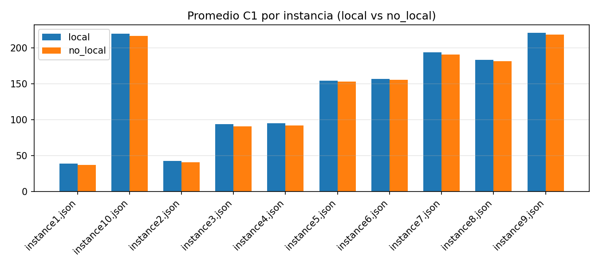

**Póster – Heurística Constructiva + Aleatorizada + Búsqueda Local**

- Problema: asignación de empleados a escritorios por día con preferencias, cohesión de grupos y balance de zonas.
- Método: constructivo aleatorizado (top‑k y orden aleatorio, controlado por semilla) + búsqueda local por swaps con evaluación lexicográfica (C1,C2,C3).
- Experimentos: local vs no_local, 10 semillas, iters=1200, top-k=3.

Resultados promedio por instancia (tabla):

**Tabla comparativa (promedios y mejor corrida)**

| instance | method | avg_C1 | avg_C2 | avg_C3 | avg_time(s) | best (C1, C2, C3) |
|---|---|---:|---:|---:|---:|---|
| instance1.json | local | 38.900 | 32.200 | -6.200 | 0.092821 | (39, 34, -3) |
| instance1.json | no_local | 37.000 | 31.400 | -6.200 | 0.000311 | (38, 32, -3) |
| instance10.json | local | 219.600 | 151.400 | -1.700 | 0.434843 | (220, 160, -2) |
| instance10.json | no_local | 216.500 | 140.400 | -1.700 | 0.001526 | (218, 145, -2) |
| instance2.json | local | 43.000 | 39.000 | -5.200 | 0.090019 | (43, 41, -5) |
| instance2.json | no_local | 40.800 | 37.200 | -5.200 | 0.000300 | (43, 37, -5) |
| instance3.json | local | 94.000 | 73.600 | -4.500 | 0.152770 | (94, 83, -4) |
| instance3.json | no_local | 90.800 | 66.000 | -4.500 | 0.000510 | (93, 67, -3) |
| instance4.json | local | 95.000 | 72.800 | -4.200 | 0.155095 | (95, 76, -4) |
| instance4.json | no_local | 92.300 | 66.100 | -4.200 | 0.000569 | (94, 74, -4) |
| instance5.json | local | 154.000 | 119.500 | -12.400 | 0.245443 | (154, 126, -16) |
| instance5.json | no_local | 153.000 | 113.300 | -12.400 | 0.000960 | (154, 121, -16) |
| instance6.json | local | 157.000 | 121.300 | -9.900 | 0.251063 | (157, 131, -7) |
| instance6.json | no_local | 155.500 | 113.800 | -9.900 | 0.000933 | (157, 121, -9) |
| instance7.json | local | 193.800 | 131.200 | -2.400 | 0.342162 | (194, 138, -2) |
| instance7.json | no_local | 190.400 | 119.900 | -2.400 | 0.001311 | (193, 120, -2) |
| instance8.json | local | 183.000 | 131.000 | -6.300 | 0.329517 | (183, 143, -7) |
| instance8.json | no_local | 181.300 | 119.900 | -6.300 | 0.001242 | (183, 133, -7) |
| instance9.json | local | 220.900 | 149.600 | -1.200 | 0.430553 | (221, 156, -1) |
| instance9.json | no_local | 218.200 | 138.700 | -1.200 | 0.001564 | (220, 146, -1) |

Pseudocódigo (resumen)

Constructivo aleatorizado (por día):
- Para cada día d: obtener presentes; mezclar con semilla.
- Para cada empleado e: estimar zona objetivo de su grupo (mayoría actual).
- Elegir escritorio: (i) preferidos en zona objetivo (top-k aleatorio),
  (ii) preferidos restantes (top-k aleatorio), (iii) cualquier libre (preferir zona objetivo).
- Completar ausentes con none.

Búsqueda local (swaps):
- Repetir iters: elegir día aleatorio; si hay ≥2 asignados, proponer swap entre dos;
  aceptar si (C1,C2,C3) mejora lexicográficamente.

Conclusiones y recomendaciones

- En promedio, 10/10 instancias favorecen 'local' (mejor C1).
- 'local' cuesta más tiempo (≈10^2–10^3 ms según instancia y iters) pero mejora la calidad.
- Parámetros recomendados: top-k=3, iters≈1000–1500, seed fija para reproducibilidad.
- Sensibilidad: aumentar iters mejora C1 con rendimientos decrecientes; top‑k>1 da diversidad útil.

Gráficas (local vs no_local):

- avg_C1.png
  

- avg_C2.png
  

- avg_C3.png
  

- avg_time.png
  

